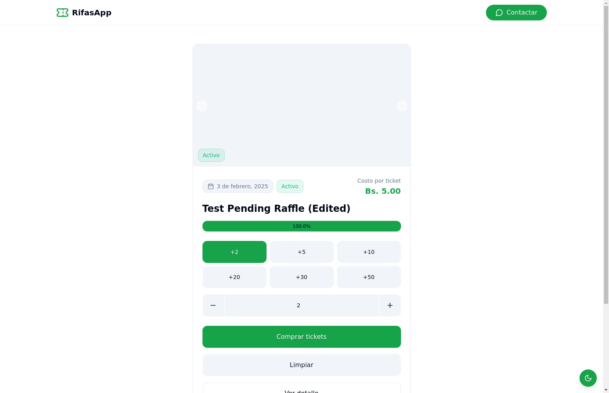
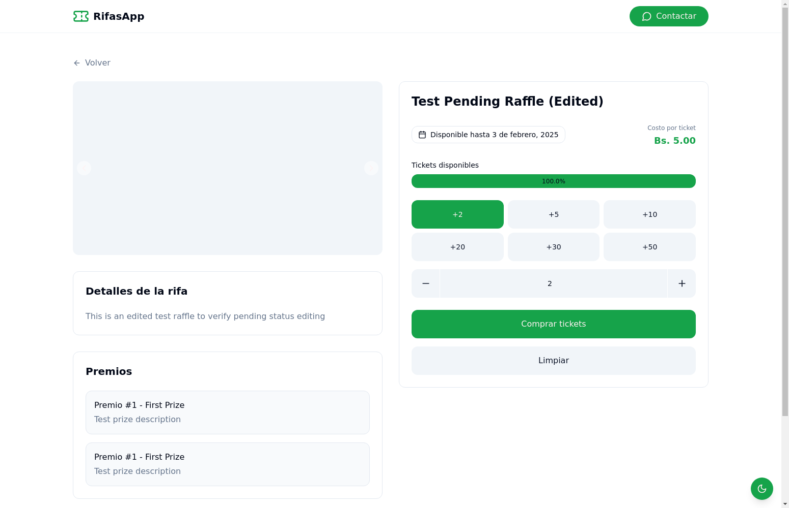
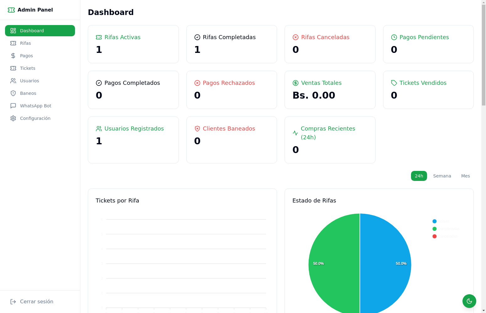
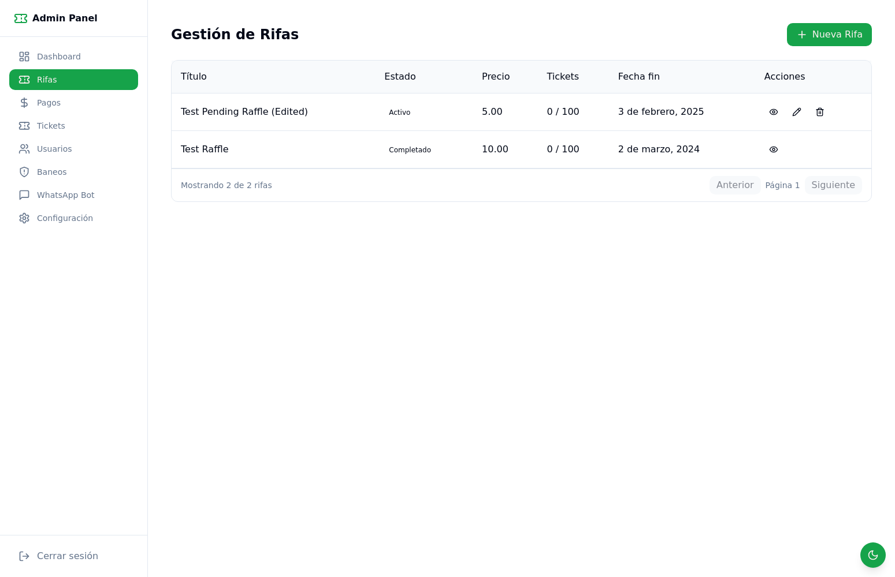
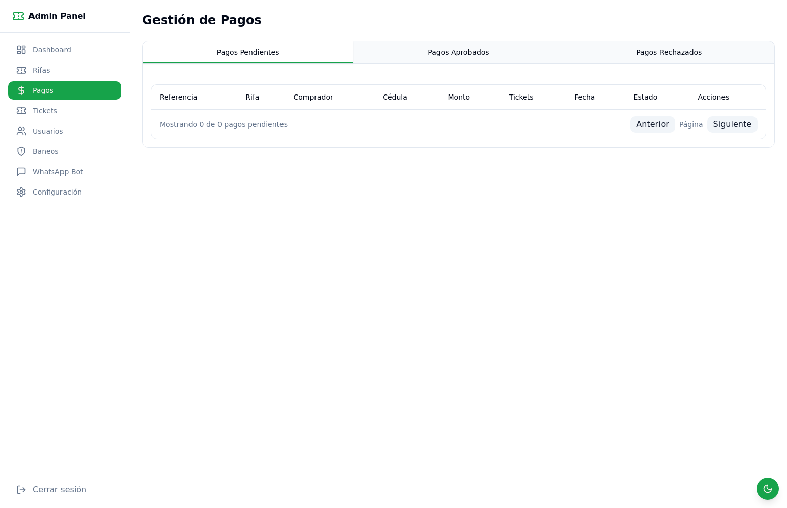
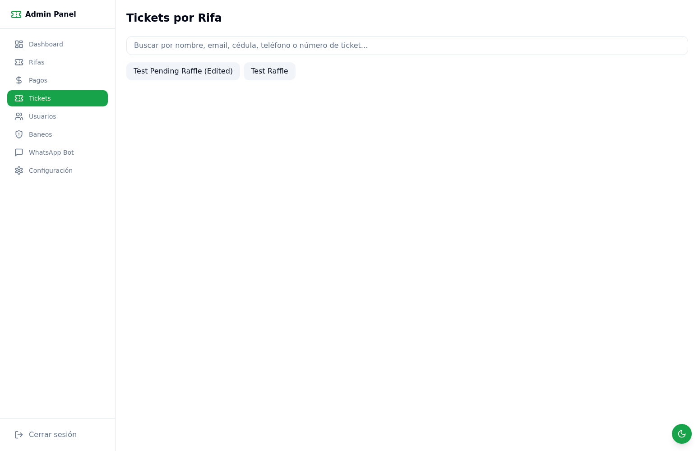
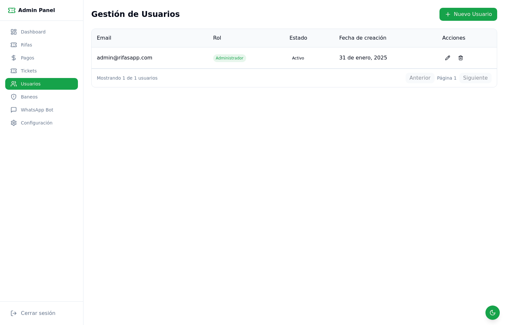
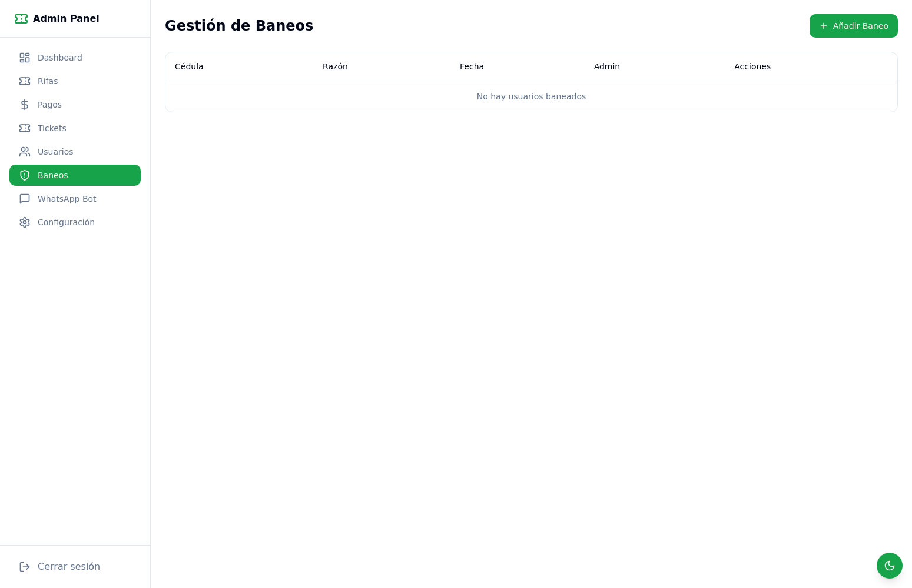
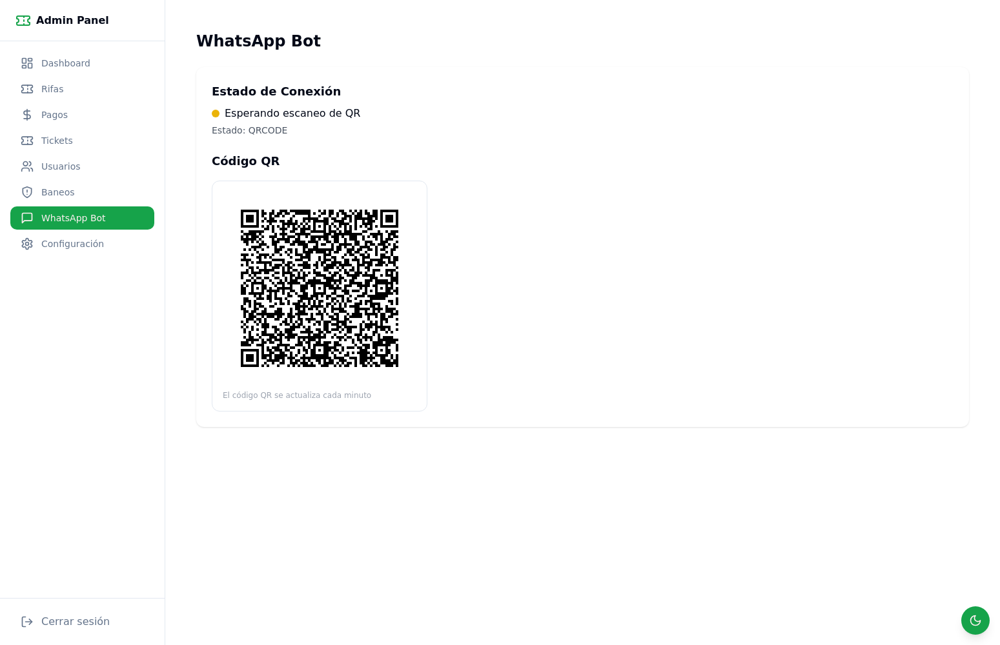
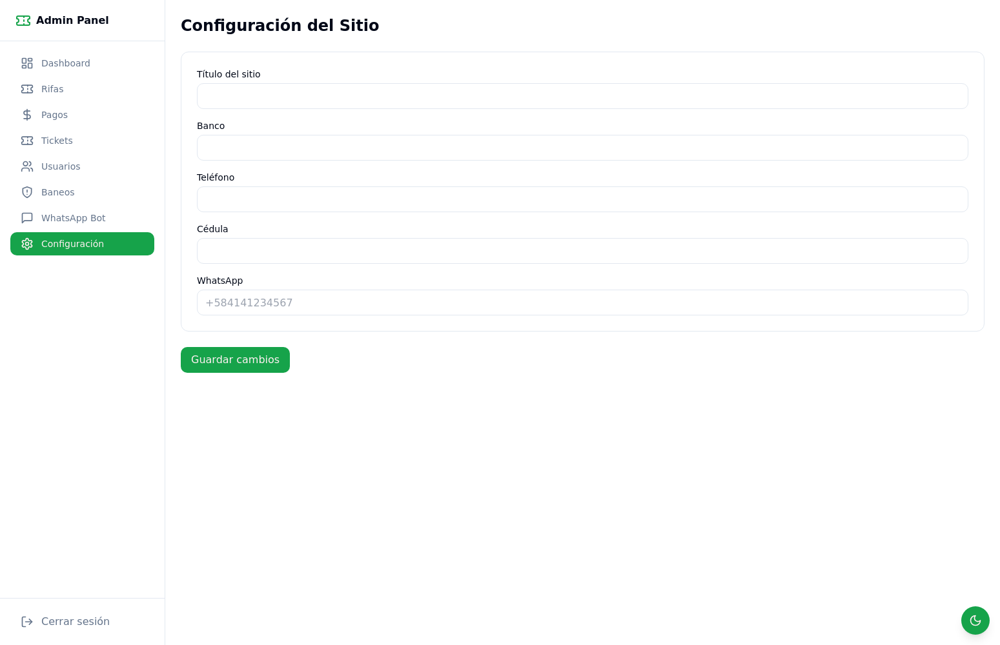

# RifasApp 🎫

Sistema de gestión y venta de rifas en línea.

## 🏠 Página Principal

La página principal ofrece:
- 🎫 Listado de rifas activas
- 💰 Sistema de compra de tickets
- 📊 Barra de progreso de ventas
- 🔍 Vista previa de detalles

## 🎯 Detalles de Rifa

Cada rifa muestra:
- 📝 Información detallada de la rifa
- 🎲 Opciones de compra de tickets
- 🏆 Lista de premios
- ⏳ Fecha límite de participación

## ⚙️ Panel de Administración

### 📊 Dashboard

El panel principal muestra:
- Estadísticas generales
- Resumen de rifas activas
- Estado de pagos
- Métricas de ventas

### 🎫 Gestión de Rifas

Permite:
- Crear nuevas rifas
- Editar rifas existentes
- Gestionar estados
- Ver detalles completos

### 💳 Gestión de Pagos

Sistema de validación de pagos con:
- Pagos pendientes
- Pagos aprobados
- Pagos rechazados
- Historial completo

### 🎟️ Gestión de Tickets

Control de tickets:
- Búsqueda por múltiples criterios
- Visualización por rifa
- Estado de tickets
- Asignación de números

### 👥 Gestión de Usuarios

Administración de usuarios:
- Creación de usuarios
- Asignación de roles
- Control de acceso
- Estado de cuentas

### 🚫 Gestión de Baneos

Sistema de control:
- Lista de usuarios baneados
- Razones de baneo
- Historial de acciones
- Gestión de restricciones

### 💬 WhatsApp Bot

Integración con WhatsApp:
- Estado de conexión
- Código QR de autenticación
- Mensajes automáticos
- Notificaciones

### ⚙️ Configuración del Sistema

Ajustes generales:
- Datos del sitio
- Información bancaria
- Configuración de contacto
- Personalización

## 🛠️ Requisitos del Sistema

- Node.js 18 o superior
- MySQL 8.0 o superior
- npm/pnpm/yarn

## 🛠️ Contacto para compra

Facebook Messenger: https://m.me/yosoyeddw
Instagram: https://instagram.com/thisiseddw
Telegram: https://t.me/thisisedd